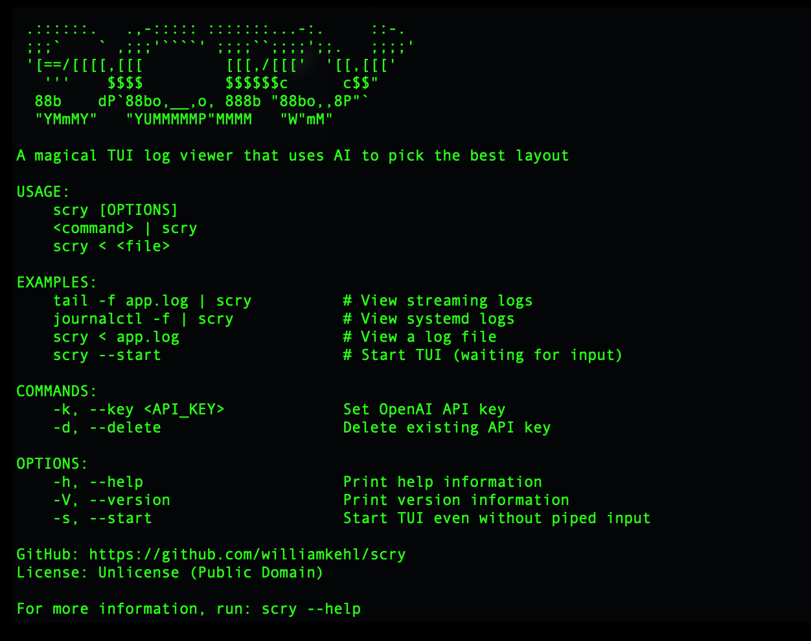

# scry



CI Build Status | License: Unlicense

> **Note**: This project is a work in progress. We welcome contributions! If you'd like to help improve `scry`, please submit pull requests on [GitHub](https://github.com/williamkehl/scry).

## Introduction

`scry` is a magical terminal UI (TUI) log viewer that uses AI to automatically select the best layout for viewing your logs in real-time.

`scry` reads logs from stdin and displays them in an intelligent, adaptive interface. When you press `a` (analyze), it sends a sample of recent log lines to OpenAI's API, which analyzes the log format and selects the optimal view strategy. The TUI then switches layouts instantly based on the AI's recommendation.

The application is designed to be **100% resilient** - it handles any type of log input, including:
- Structured JSON logs
- Key-value pair logs
- Plain text logs
- Mixed formats
- Unicode and emojis
- Control characters
- Malformed data
- Very long lines
- Binary data (with safe conversion)

`scry` is written in Rust and uses `ratatui` for the terminal UI.

For more information visit [https://github.com/williamkehl/scry](https://github.com/williamkehl/scry).

## Features

- **AI-Powered View Selection**: Automatically detects the best view layout (Plain, KeyValue, Json, or external tools) using OpenAI's API
- **Real-time Log Streaming**: Continuously displays logs as they stream in from stdin
- **Multiple View Modes**:
  - **Plain**: Simple scrollable list for unstructured logs
  - **KeyValue**: Parses and displays `key=value` pairs in a table
  - **Json**: Parses JSON logs and displays key-value pairs in a formatted table
  - **External Tools**: Automatically launches specialized TUI tools when appropriate (see [External Tools](#external-tools) below)
- **Plugin System**: Extensible architecture that supports external TUI tools from the [awesome-tuis](https://github.com/rothgar/awesome-tuis) ecosystem
- **Resilient Input Handling**: Accepts any log format, special characters, unicode, control codes, and malformed data
- **Keyboard Controls**: Full keyboard support even when stdin is piped (reads from `/dev/tty`)
- **Navigation & Filtering**: Scroll through logs, select lines, and live-filter based on selected text
- **Real-time Filtering**: Filters update automatically as new matching logs stream in
- **API Key Management**: Secure storage of OpenAI API key in config directory

## Build Instructions

### Prerequisites

List of build-time dependencies:

* Rust toolchain (Rust 1.70+)
  * `cargo` (comes with Rust)
  * `rustc` (Rust compiler)

**Install Rust:**

```bash
curl --proto '=https' --tlsv1.2 -sSf https://sh.rustup.rs | sh
```

Or use your system's package manager:

**macOS**
```bash
brew install rust
```

**Debian/Ubuntu**
```bash
sudo apt install rustc cargo
```

**Fedora/RHEL**
```bash
sudo dnf install rust cargo
```

**Archlinux/Manjaro**
```bash
sudo pacman -S rust
```

### Compile from Source

To compile from source, clone the repository and build:

```bash
git clone https://github.com/williamkehl/scry.git
cd scry
cargo build --release
```

The binary will be in `target/release/scry`.

### Install

To install on the local system:

```bash
cargo install --path .
```

This installs `scry` to `~/.cargo/bin/scry` (or `$CARGO_HOME/bin/scry` if `CARGO_HOME` is set).

Alternatively, you can copy the binary manually:

```bash
sudo cp target/release/scry /usr/local/bin/
```

## Usage

### Setting up OpenAI API Key

Before using the AI analysis feature, set your OpenAI API key:

```bash
scry -k YOUR_API_KEY
# or
scry --key YOUR_API_KEY
```

The key is stored securely in your config directory:
- Linux: `~/.config/scry/api_key`
- macOS: `~/.config/scry/api_key`
- Windows: `%APPDATA%\scry\api_key`

To delete the API key:

```bash
scry -d
# or
scry --delete
```

### Running scry

**With piped input (recommended):**
```bash
tail -f app.log | scry
journalctl -f | scry
docker logs -f container_name | scry
```

**With file input:**
```bash
scry < app.log
cat app.log | scry
```

**Start TUI without input (waits for input):**
```bash
scry --start
```

**Show help:**
```bash
scry
# or
scry --help
```

### Controls

While running `scry`, use these keyboard shortcuts:

**Analysis:**
- **`a`** - Analyze logs and switch to the best view layout (requires API key)

**Navigation:**
- **`↑` / `↓`** - Navigate up/down through logs
- **`PageUp` / `PageDown`** - Jump 10 lines up/down
- **`Home` / `End`** - Jump to the first/last log line

**Filtering:**
- **`f`** - Toggle filter mode: select the current line to filter logs by its content. Press again to clear.
- **`c` / `Esc`** - Clear current filter/selection

**Quit:**
- **`q`** - Quit the application
- **`Ctrl+C`** - Quit the application (also works when stdin is piped)

### Examples

**View application logs:**
```bash
tail -f /var/log/app.log | scry
```

**View systemd logs:**
```bash
journalctl -f | scry
```

**View Docker container logs:**
```bash
docker logs -f my-container | scry
```

**View Kubernetes pod logs:**
```bash
kubectl logs -f pod-name | scry
```

**Test with sample logs:**
```bash
./test_logs.sh 1 | scry    # Test specific log type
./test_logs.sh | scry       # Test random log type
```

## How It Works

1. **Log Streaming**: `scry` reads log lines from stdin and maintains a buffer of the most recent ~2000 lines.

2. **View Strategies**: The app supports multiple view strategies:
   - **Plain**: Simple scrollable list of log lines (good for unstructured logs)
   - **KeyValue**: Parses `key=value` pairs and displays them in a table (good for structured key-value logs)
   - **Json**: Parses JSON logs and displays key-value pairs in a table (good for structured JSON logs)
   - **External Tools**: Launches specialized TUI tools when they provide a better viewing experience

3. **AI Analysis**: When you press `a`, the app:
   - Takes the last ~100 log lines
   - Sanitizes and prepares them for API transmission
   - Sends them to OpenAI's API (gpt-4o-mini)
   - The model analyzes the log format and returns a JSON response indicating which view is best
   - If an external tool is recommended, `scry` checks if it's installed and launches it automatically
   - The TUI instantly switches to the recommended view (or launches the external tool)

4. **Live Updates**: The TUI continuously updates as new log lines stream in, and you can re-analyze at any time to switch views.

5. **Navigation & Filtering**:
   - Use arrow keys, PageUp/PageDown, Home/End to navigate through logs
   - Press `f` on any line to extract a meaningful string (e.g., a JSON value, a key-value pair's value, or a significant word) and apply it as a live filter
   - Only lines containing the filter text are displayed, and the filter text itself is highlighted within those lines
   - The selected line is visually distinct (yellow background)
   - Filters work across all view modes (Plain, KeyValue, Json)
   - New logs that match the active filter are automatically added to the filtered results in real-time
   - Press `c` or `Esc` to clear the filter and return to viewing all logs

6. **Resilience**: All input is sanitized for safe display:
   - Control characters are replaced or removed
   - Very long lines are truncated (with indication)
   - Invalid UTF-8 is handled gracefully
   - Malformed JSON is skipped (doesn't crash)
   - Empty lines are preserved
   - Special characters and unicode are supported

## Navigation & Filtering

`scry` provides powerful navigation and filtering capabilities that work across all view modes.

### Navigation

Navigate through your logs using standard keyboard shortcuts:
- **Arrow keys** (`↑`/`↓`) - Move one line at a time
- **PageUp/PageDown** - Jump 10 lines at a time
- **Home/End** - Jump to the first or last log line

The scroll position is maintained when switching between views, and the current position is always visible.

### Filtering

Filter logs in real-time by selecting a line and extracting meaningful text from it:

1. **Activate Filter Mode**: Press `f` on any line to select it and extract filter text
   - For JSON logs: Extracts values from JSON fields
   - For key-value logs: Extracts values from `key=value` pairs
   - For plain logs: Extracts the first meaningful word

2. **Live Filtering**: Once a filter is active:
   - Only logs containing the filter text are displayed
   - The filter text is highlighted (bold yellow) within matching lines
   - The selected line is highlighted with a yellow background
   - The filter status and match count are shown in the view title

3. **Real-time Updates**: As new logs stream in:
   - Logs that match the active filter are automatically added to the filtered view
   - The match count updates in real-time
   - No need to re-apply the filter

4. **Clear Filter**: Press `c` or `Esc` to clear the filter and return to viewing all logs

### Filtering Examples

**Filter by JSON value:**
```
Press 'f' on: {"level":"ERROR","msg":"connection failed"}
Filter extracts: "connection failed"
Result: Shows only logs containing "connection failed"
```

**Filter by key-value:**
```
Press 'f' on: status=500 error=timeout
Filter extracts: "500" or "timeout"
Result: Shows only logs containing the extracted value
```

**Filter by word:**
```
Press 'f' on: [2024-01-01] User login failed
Filter extracts: "User" or "login" or "failed"
Result: Shows only logs containing the extracted word
```

Filtering works consistently across Plain, KeyValue, and Json views, making it easy to focus on specific log entries regardless of the view mode.

## External Tools

`scry` includes a plugin system that automatically detects and launches external TUI tools when they provide a better viewing experience than the built-in views. The AI will suggest external tools when appropriate, and `scry` will automatically launch them if they're installed.

### Supported External Tools

The following tools are automatically detected and can be launched by the AI:

- **`jless`** - JSON viewer with syntax highlighting and navigation
- **`fx`** - Interactive JSON viewer with search and filtering
- **`visidata`** - Interactive spreadsheet/data analysis tool for structured data
- **`tabview`** - Table viewer for structured data
- **`lnav`** - Advanced log file viewer with SQL queries and filtering
- **`gonzo`** - Real-time log analysis terminal UI
- **`csvtk`** - CSV/TSV viewer and processor
- **`less`** - Text viewer with search and navigation (fallback)

### How External Tools Work

1. When you press `a` to analyze logs, the AI considers both built-in views and available external tools
2. If an external tool would provide a better experience (e.g., `jless` for complex JSON, `visidata` for tabular data), the AI will suggest it
3. `scry` automatically checks if the suggested tool is installed
4. If installed, `scry` temporarily exits its TUI, launches the external tool with your logs piped to it, and returns control when the tool exits
5. If not installed, `scry` falls back to the most appropriate built-in view

### Installing External Tools

External tools are optional. Install only the ones you want to use:

**macOS (Homebrew):**
```bash
brew install jless visidata lnav
```

**Linux (varies by distribution):**
```bash
# Debian/Ubuntu
sudo apt install visidata lnav

# Fedora
sudo dnf install visidata lnav

# Arch
sudo pacman -S visidata lnav
```

**Rust tools (via cargo):**
```bash
cargo install jless fx csvtk
```

### Adding Custom Tools

To add support for additional external tools, edit `src/plugins.rs` and add entries to the `all_tools()` function. The plugin system will automatically detect installed tools and include them in the AI's options.

## Project Structure

```
scry/
├── src/
│   ├── main.rs          # Entry point, TUI loop, keyboard handling, CLI
│   ├── app.rs           # AppState struct and state management (logs, views, navigation, filter)
│   ├── views.rs         # ViewKind enum and view rendering implementations (Plain, KeyValue, Json, ExternalTool)
│   ├── openai.rs        # OpenAI API integration (log analysis, view suggestion)
│   ├── config.rs        # API key storage and retrieval
│   ├── input_source.rs  # Detect input source (file/command)
│   ├── keyboard.rs      # Keyboard input from /dev/tty when stdin is piped (handles escape sequences)
│   ├── plugins.rs       # External TUI tool integration (registry, detection, spawning)
│   └── utils.rs         # Sanitization and safe string handling utilities
├── Cargo.toml           # Rust project configuration and dependencies
├── LICENSE              # Unlicense (Public Domain)
├── README.md            # This file
├── TESTING.md           # Testing documentation
└── test_logs.sh         # Comprehensive test suite (32 test cases)
```

## Dependencies

### Required Dependencies

* `ratatui` - Terminal UI library
* `crossterm` - Cross-platform terminal manipulation
* `tokio` - Async runtime
* `clap` - Command-line argument parsing
* `reqwest` - HTTP client for OpenAI API
* `serde` / `serde_json` - JSON serialization/deserialization
* `anyhow` - Error handling
* `atty` - Detect if stdin/stdout is a TTY
* `dirs` - Platform-specific config directory paths
* `ctrlc` - Signal handling (Ctrl+C)
* `libc` - Low-level system calls (for /dev/tty keyboard input)

All dependencies are managed by Cargo and specified in `Cargo.toml`.

## Testing

See [TESTING.md](TESTING.md) for comprehensive testing instructions.

Quick test:
```bash
./test_logs.sh 1 | cargo run    # Test specific log type
./test_logs.sh | cargo run      # Test random log type
```

The test suite includes 32 different test cases covering various log formats, edge cases, and real-world scenarios.

## Development

**Run in development mode:**
```bash
cargo run
```

**Run with test input:**
```bash
echo -e "foo=bar\nlevel=INFO\nmsg=hello" | cargo run
```

**Build for release:**
```bash
cargo build --release
```

**Run tests:**
```bash
cargo test
```

**Check code:**
```bash
cargo check
```

**Format code:**
```bash
cargo fmt
```

**Lint code:**
```bash
cargo clippy
```

## Support

If you have trouble running `scry`:

1. Check that you have Rust installed: `rustc --version`
2. Ensure stdout is a TTY (scry requires a terminal)
3. Check that your OpenAI API key is set: `scry -k YOUR_KEY`
4. Review the help: `scry --help`

## Bugs, Development Feedback

If you have found an issue or have a feature request, please check the [GitHub issue tracker](https://github.com/williamkehl/scry/issues). If the issue hasn't been reported, please file a new issue describing:
- The problem you encountered
- Steps to reproduce
- Expected vs actual behavior
- Your system information (OS, Rust version, etc.)

## Contributing

**This project is a work in progress and we actively welcome contributions!**

We invite you to help improve `scry` by:
- **Submitting pull requests** on [GitHub](https://github.com/williamkehl/scry) - we'd love to see your improvements!
- Reporting bugs via the [issue tracker](https://github.com/williamkehl/scry/issues)
- Suggesting new features
- Improving documentation
- Adding test cases
- Enhancing the plugin system with more external tools

This project is in the public domain (Unlicense), so feel free to contribute in any way you'd like. All contributions are appreciated!

## License

This project is released into the public domain under the [Unlicense](LICENSE).

You are free to use, modify, distribute, and sell this software for any purpose, commercial or non-commercial, without any restrictions.

## About

scry - A magical TUI log viewer that uses AI to pick the best layout

GitHub: [https://github.com/williamkehl/scry](https://github.com/williamkehl/scry)

License: Unlicense (Public Domain)
